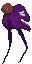

#  Actually Working Game 

    ABOUT

    Metroidvania (side-view adventure)
    Yet another awg, but this time with (no) mistakes, that were in previous games
    
    Graphic engine: OpenGL 4.0+ (PyOpenGL), glsl shaders 400
    Sound engine: OpenAL (PyOpenAL)
    Physic engine: Chipmunk (Pymunk)
    
    
    FILES
    ____________________________________________
    run game                   main.py
    ____________________________________________
    sprite manager               ---
    ____________________________________________
    ctypes compile               ---
    ____________________________________________
    
-